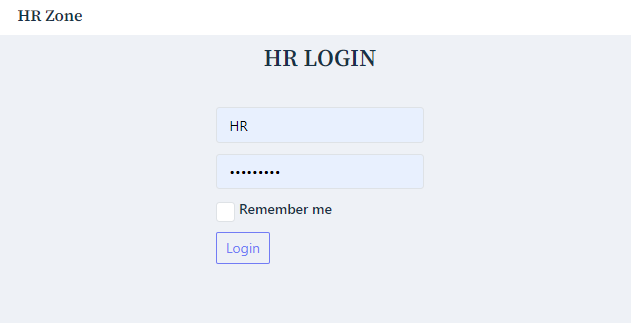
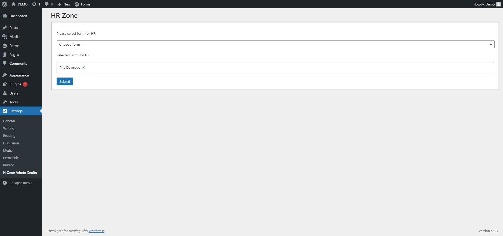
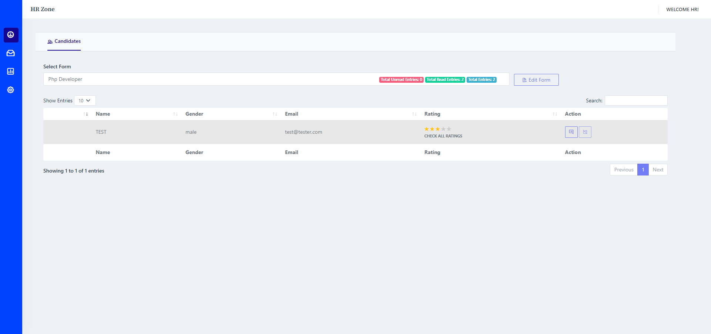
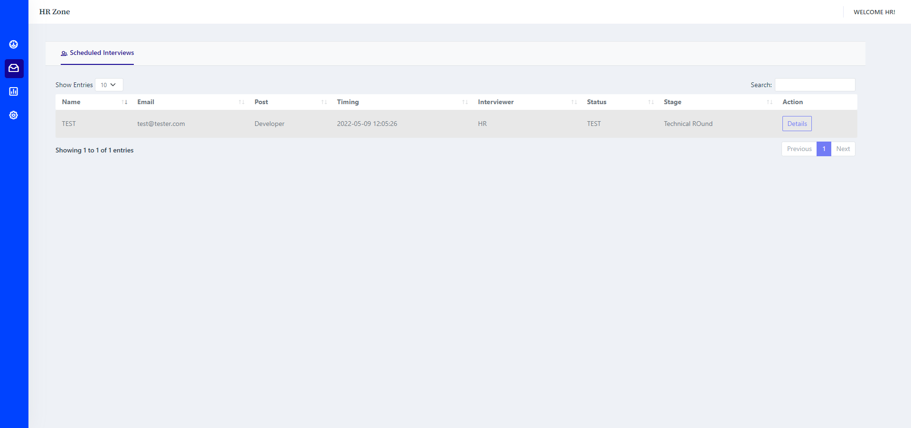
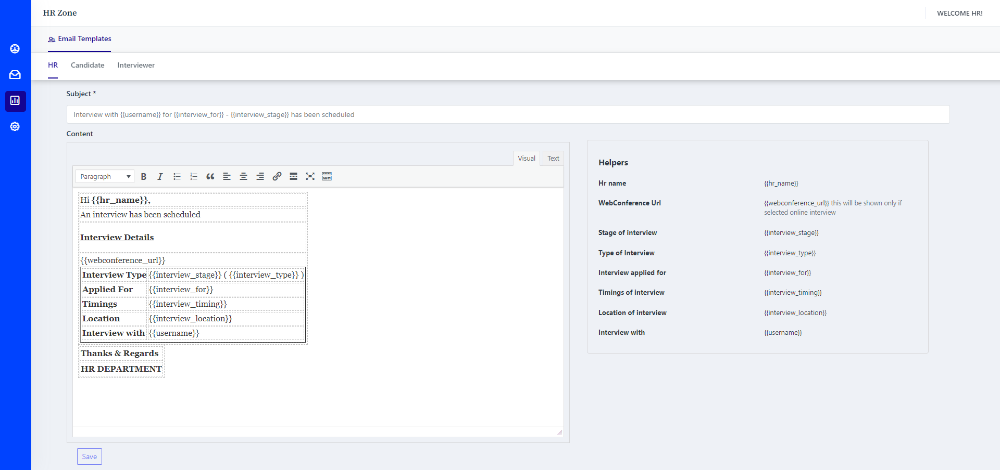
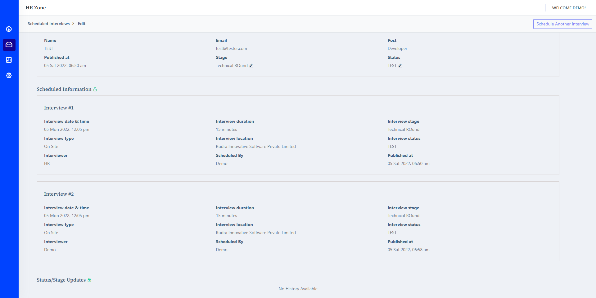

<!-- PROJECT LOGO -->
 
<!-- ABOUT THE PROJECT -->

### About The Project

This is a wordpress plugin for HR management.

### Built With

This section should list any major frameworks/libraries used to bootstrap your project. Leave any add-ons/plugins for the acknowledgements section. Here are a few examples.

* [Wordpess](https://wordpress.org/)
* [PhP](https://www.php.net/)
* [JQuery](https://jquery.com)

<!-- GETTING STARTED -->
## Getting Started

This is an example of how you may give instructions on setting up your project locally.
To get a local copy up and running follow these simple example steps.

### Prerequisites

* Only Admin and Subscriber have access.
* Plugin is specially for HR.
* This is a just an demo, not for commercial use.
* Gravity Form plugin is required.
* Setup SMTP settings for sending emails.

### Installation

1. Create a page with slug hr-zone
2. Place this [Custom_gp_show_hr_zone_shortcode] shortcode on created page.

### Usage

* Admins
    1. Admin can assign forms to the HR.
        
* HR
    1. Add job post, interview type & interview status in settings panel.
        
    2. Check assigned forms & user in dashboard.
        
    3. Schedule & reschedule interviews (online / onsite interview).
        
    4. Check & Modify email templates for interviewer, hr & candidate with custom placeholders.
        
    5. Check scheduled interviews & histroy of interviews.
        
    6. Send mail to user.
    7. Automatic Mail to nterviewer, hr & candidate on scheduling interview.
    8. New user entry notfication to HR.
    9. Rate User & Check all ratings.

## Contact

ExpertCoder - codeiexper82@gmail.com

Project Link: [https://github.com/codeiexpert/Hr-zone]

(<a href="#top">Go to top</a>)

