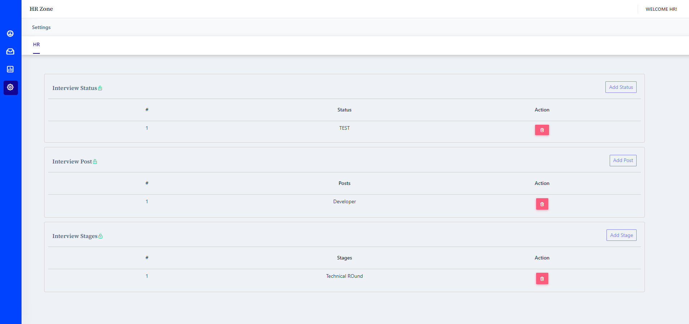

### About The Project
 

This is a wordpress plugin for HR management.

### Built With

* [Wordpess](https://wordpress.org/)
* [PhP](https://www.php.net/)
* [JQuery](https://jquery.com)

### Prerequisites

* Only Admin and Subscriber have access.
* Plugin is specially for HR.
* This is a just an demo, not for commercial use.
* Gravity Form plugin is required.
* Setup SMTP settings for sending emails.

### Installation

1. Create a page with slug <b>hr-zone</b>
2. Place this <b>[Custom_gp_show_hr_zone_shortcode]</b> shortcode on created page.

### Usage

* Admins
    1. Admin can assign forms to the HR.
        
* HR
    1. Add job post, interview type & interview status in settings panel.
         
    2. Check assigned forms & user in dashboard.
         
    3. Schedule & reschedule interviews (online / onsite interview).
         
    4. Check & Modify email templates for interviewer, hr & candidate with custom placeholders.
         
    5. Check scheduled interviews & histroy of interviews.
         
    6. Send mail to user. 
    7. Automatic Mail to nterviewer, hr & candidate on scheduling interview. 
    8. New user entry notfication to HR. 
    9. Rate User & Check all ratings.

## Contact

ExpertCoder - codeiexper82@gmail.com

Project Link: [https://github.com/codeiexpert/Hr-zone]

(<a href="#top">Go to top</a>)

